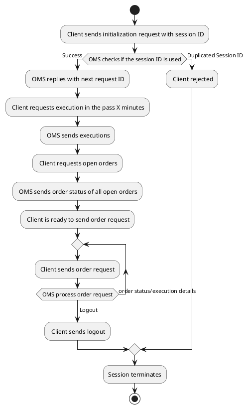
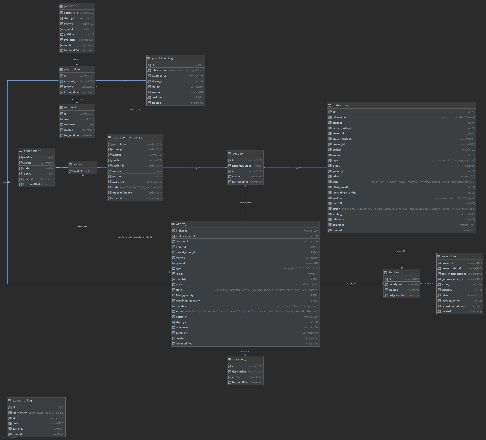

# OMS

- [Build](#build)
- [Deploy](#deploy)
- [Requirements](#requirements)
- [Message Format](#message-format)
  * [Flow of communication between OMS and client](#flow-of-communication-between-oms-and-client)
  * [Initialization](#initialization)
  * [Request next request ID](#request-next-request-id)
  * [Next Request ID](#next-request-id)
  * [Error](#error)
    + [Error codes](#error-codes)
  * [Request for executions](#request-for-executions)
  * [Request for latest open orders](#request-for-latest-open-orders)
  * [New Order](#new-order)
  * [Modify Order](#modify-order)
  * [Delete Order](#delete-order)
  * [Order Status](#order-status)
  * [Execution](#execution)
  * [Request position](#request-position)
  * [Position](#position)
  * [Heartbeat](#heartbeat)
- [Schema](#schema)
  * [Dump schema and create database](#dump-schema-and-create-database)
  * [account](#account)
  * [portfolio](#portfolio)
  * [strategy](#strategy)
  * [position](#position)
  * [market](#market)
  * [instrument](#instrument)
  * [broker](#broker)
  * [session](#session)
  * [order_](#order-)
  * [position_by_entry](#position-by-entry)
  * [execution](#execution)
  * [order_log](#order-log)
  * [position_log](#position-log)
  * [account_log](#account-log)

## Build

## Deploy

## Requirements
Packages to be install for MySQL database:
https://www.percona.com/doc/percona-server/5.7/installation/apt_repo.html
```
libperconaserverclient20
percona-server-client
percona-server-common
percona-server-server
```
Grant access from any connection
```
GRANT ALL PRIVILEGES ON *.* TO 'root'@'%' IDENTIFIED BY 'password' WITH GRANT OPTION;
FLUSH PRIVILEGES;
```
Create database with schema files
```
mysql -u root -p oms < sql/schema.sql
mysql -u root -p oms < sql/setup.samples.sql
```
## Message Format
A description of all JSON messages between OMS client and server

### Flow of communication between OMS and client


### Initialization
From client to OMS, initialize the session
```json
{
  "group": "oms",
  "msg_type": "init",
  "session_id": "client_000",
  "account_id": "Simple Account"
}
```

### Request next request ID
Client can ask for the next request ID from OMS, expect an reply of `next_reqest_id`
```json
{
  "group": "oms",
  "msg_type": "next_request_id"
}
```

### Next Request ID
From OMS to client, as a response to `init`, and `next_reqest_id`
It tells the client the next request ID to use.
```json
{
  "group": "oms",
  "msg_type": "next_request_id",
  "request_id": 12345
}
```

### Error
From OMS to client, when there is an error occurred when handling client request.
The field `request_id` is optional, present only if the client request has a request ID.
```json
{
  "group": "oms",
  "msg_type": "next_request_id",
  "request_id": 12345,
  "error_code": 123,
  "message": "An error occured!"
} 
```

#### Error codes
Error Code|Description
---|---
100|System error
101|Duplicated session ID
102|Bad request ID (e.g. out of order request ID)

### Request for executions
_**No required in Phase I**_

Expects an `executions` reply
```json
{
  "group": "oms",
  "msg_type": "execution_history",
  "request_id": 123,
  "duration": 1440
}
```

### Request for latest open orders
_**No required in Phase I**_

Expects a `order_status` reply
```json
{
  "group": "oms",
  "msg_type": "order_status",
  "request_id": 123
}
```

### New Order 
Client sends an order to the market, expects `order_status`
```json
{
  "group": "oms",
  "msg_type": "new_order",
  "request_id": 12345,
  "market": "CME",
  "symbol": "CL",
  "order_type": "limit",
  "is_buy": false,
  "quantity": 10,
  "price": 10.23,
  "portfolio": "simple_portfolio",
  "action" : "entry",
  "strategy" : "NQ_Daily_Long",
  "reference": "reference_content",
  "comment": [
    {
      "key": "atr_risk",
      "value": 0.05
    }
  ]
}
```

### Modify Order
_**No required in Phase I**_

Client modifies an outstanding order, either `quantity` or `price` can be missing.
Expects `order_status`
```json
{
  "group": "oms",
  "msg_type": "modify_order",
  "request_id": 12345,
  "order_id": 98765,
  "quantity": 10,
  "price": 10.23
}
```

### Delete Order 
_**No required in Phase I**_

Client deletes an outstanding order, expects `order_status`
```json
{
  "group": "oms",
  "msg_type": "delete_order",
  "request_id": 12345,
  "order_id": 12345678
}
```

### Order Status
From OMS to client, sent when:
- Received an `new_order`, `cancel_order`, `modify_order` request
- In response to an `order_request` request
- When order status changes (execution, unsolicited cancel) on the broker side. No `request_id` is included in such cash

```json
{
  "group": "oms",
  "msg_type": "order_status",
  "request_id": 123,
  "items": 
  [
    {
      "order_id": 123,
      "state": "active",
      "market": "CME",
      "symbol": "CL",
      "msg_type": "limit",
      "is_buy": false,
      "quantity": 10,
      "price": 50.67,
      "reference": "reference_content",
      "comment": {
          "atr_risk": 0.05
      },
      "timestamp": "2019-10-10T23:00:05"
    }
  ]
}
```

### Execution
_**No required in Phase I**_

OMS send to client when an order is executed. Or when `execution` request is received
The field `request_id` is not present only if replying to a request.
```json
{
  "group": "oms",
  "msg_type": "execution",
  "request_id": 123,
  "items": 
  [
    {
      "order_id": 123,
      "execution_id": "exec-000",
      "execution_time": "2019-10-10T23:00:00",
      "market": "CME",
      "symbol": "CL",
      "is_buy": true,
      "quantity": 10,
      "price": 50.67,
      "leave_quantity": 20,
      "portfolio": "my_portfolio",
      "strategy": "NQ_Daily_Long",
      "action": "ENTRY",
      "reference": "order_reference",
      "comment": {
        "atr": 0.321
      }
    }
  ]
}
```

### Request position
Client send to OMS to get request the latest position
```json
{
  "group": "oms",
  "msg_type": "position",
  "request_id": 123
}
```

### Position
OMS sends this message in response to the client request `position`. Or when where is any changes to the position.
```json
{
  "group": "oms",
  "msg_type": "position",
  "request_id": 123,
  "account": {
    "id": "Simple Account",
    "cash": 1000000,
    "currency": "USD", 
    "portfolios": [
      {    
        "id" : "Simple Portfolio",
        "positions": [
          {
            "strategy": "NQ_Daily_Long",
            "market": "NYMEX",
            "symbol": "CL", 
            "position": 100,
            "avg_price": 56.78
          },
          {
            "strategy": "NQ_Daily_Short",
            "market": "CME",
            "symbol": "NQ",  
            "position": -100,
            "avg_price": 5678.1
          }
        ]
      }
    ]
  } 
}
```

### Heartbeat
Between OMS and client, the `next` field states when the next heart beat should arrive client
`is_ready` is only sent from OMS to client, indicating if it is ready to send order
```json
{
  "group": "oms",
  "msg_type": "heartbeat",
  "timestamp": "2019-08-06T16:05:02",
  "next": "2019-08-06T16:05:05",
  "is_ready" : true,
  "message": "Ready for order"
}
```

## Schema
OMS uses MySQL to store order status, executions and position. Here is a description of the schema.



### Dump schema and create database
- To dump a SQL script to rebuild the whole OMS database, do the following:
    ```shell
    wrcadmin@wrchkbt02  ~
    $ mysqldump -u root -p --no-data --databases oms >> schema.sql
    Enter password:
    wrcadmin@wrchkbt02  ~
    ```
- Then build the database with `schema.sql`: 
    ```shell
    wrcadmin@wrchkdev06:~$ cat schema.sql | mysql -uroot -p
    Enter password:
    wrcadmin@wrchkdev06:~$
    ```

### account
- This table stores accounts available for trading and the amount of cahs in each account.
- We need to manually update the table. Currently it is read-only in OMS.

### portfolio
- This table stores portfolios defined.
- It is a read-only table and OMS does not modify it.

### strategy
- This table stores list of strategies that connected to OMS.
- The strategy name is defined in SmartQuant configuration, under `strategy` in the YAML configuration file.
- When a strategy connects to OMS, it sends the account name, portfolio and strategy name to OMS. If OMS can find a matching account and portfolio, OMS will automatically insert a new record to `strategy` table if the strategy is not there. 

### position
- This tables stores the position of strategies.
- It is managed by the OMS.

### market
- This table stores list of markets OMS currently support.
- If we are trading any new market we need to manually add entry to this table.

### instrument
- This table stores all instruments supported by the OMS.
- When OMS needs to trade a new instrument, we need to manually insert a new row describing that instrument.
- The fields `code` and `expiry` are updated by OMS automatically depends on the value OMS gets from the contract JSON file. The location of the JSON files are specified in `instruments.yml`. OMS stores the front month exchange symbols and expiry in the database. 

### broker
- Unused currently

### session
- This table stores the next request ID for each session. Usually, one session corresponds to one SmartQuant instance, each session is capable of sending orders and when OMS receives an execution, it will dispatch the execution notification only to the session that sends the order.
- This table is managed by the OMS 

### order_
- This table stores every order OMS ever sends out to brokers.
- OMS updates order status when the order is sent, filled or deleted.

### position_by_entry
- This table is for MultiEntry policy.
- Each row corresponds to a entry action, right now there is an one-to-one relationship between an entry and order.
- Each entry position's state will be updated if it is stopped out or exited.
- The field `order_reference` is used to map the position with the corresponding order. In the table `order_`, this field is stored in the JSON map in the field `comment`.

### execution
- This table stores all execution reported by brokers.
- OMS insert a new row to this table whenever it receives an execution from an order sent by it. 

### order_log
- Audit log table for the table `order_`, every insert, delete, update to the table is recorded.

### position_log
- Audit log table for the table `position_log`, every insert, delete, update to the table is recorded.

### account_log
- Audit log table for the table `account_log`, every insert, delete, update to the table is recorded.
